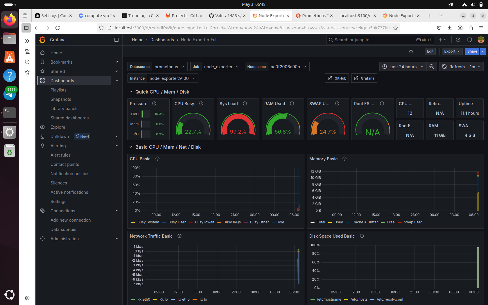
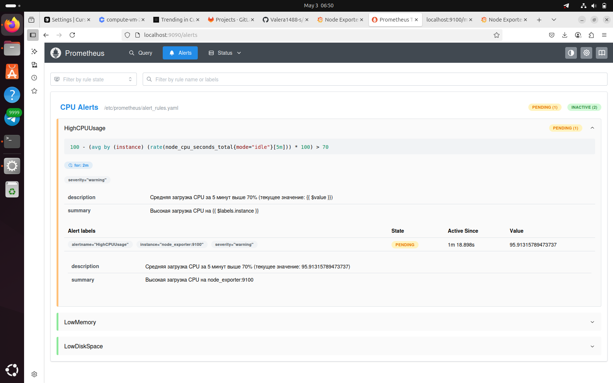

# Prometheus + Grafana Monitoring Demo

> Простой и быстрый способ настроить мониторинг серверов с красивыми графиками, алертами и автоматизацией через Ansible.
## О чём этот проект?

Это учебный (и в то же время практический) проект для мониторинга серверов и сервисов.
Prometheus собирает метрики, node_exporter отдаёт данные о системе, Grafana визуализирует всё это на дашбордах.
Всё разворачивается одной командой через Docker Compose или полностью автоматически через Ansible.

## Что тут можно?

- Следить за состоянием сервера: CPU, память, диск, сеть.
- Смотреть красивые графики в Grafana.
- Получать алерты при перегрузке процессора, нехватке памяти или места на диске.
- Разворачивать инфраструктуру одной командой через Docker Compose или Ansible.
- Использовать best practices DevOps: роли Ansible, автоматический линтинг, CI/CD.
-
 ## Как устроен проект?

- `docker-compose.yml` — быстрый запуск всех сервисов.
- `prometheus.yml` — конфиг Prometheus (метрики, таргеты).
- `alert_rules.yaml` — правила алертов.
- `ansible/` — автоматизация развёртывания через Ansible (структура с ролями).
- `screenshots/` — примеры дашбордов и алертов.
- `.github/workflows/ansible-lint.yml` — автоматическая проверка Ansible playbook через GitHub Actions.

## Как запустить через Docker Compose?

1. Склонируйте репозиторий:
   ```bash
   git clone https://github.com/Valera1488-s/prometheus-monitoring.git
   cd prometheus-monitoring
   ```

2. Запустите всё одной командой:
   ```bash
   docker compose up -d
   ```

3. Откройте в браузере:
   - Prometheus: [http://localhost:9090](http://localhost:9090)
   - Grafana: [http://localhost:3000](http://localhost:3000)  
     (логин/пароль: admin/admin — не забудьте поменять для продакшена!)

## Как запустить через Ansible?

1. Перейдите в папку ansible:
   ```bash
   cd ansible
   ```

2. Запустите playbook:
   ```bash
   ansible-playbook -i inventory.ini deploy.yml -K
   ```
   (флаг `-K` нужен для ввода sudo-пароля)

3. После выполнения playbook все сервисы будут развернуты автоматически.


## Как проверить, что алерты работают?

- Чтобы нагрузить процессор, выполните:
  ```bash
  for i in {1..12}; do yes > /dev/null & done
  ```
- Чтобы остановить нагрузку:
  ```bash
  killall yes
  ```
- После этого посмотрите алерты в Prometheus или Grafana — если всё настроено, увидите сработавшие предупреждения.

## Как это выглядит?

### Пример дашборда Grafana


### Пример алертов Prometheus


## Технологии, которые я использовал

- **Prometheus** — сбор метрик
- **Grafana** — визуализация
- **node_exporter** — отдаёт метрики о системе
- **Docker Compose** — всё запускается одной командой
- **Ansible** — автоматизация развёртывания (структура с ролями, best practices)
- **GitHub Actions** — автоматическая проверка Ansible playbook (CI/CD)

## Качество и автоматизация

- В проекте настроен автоматический линтинг Ansible playbook через GitHub Actions.
- Все изменения проходят проверку на best practices и ошибки.
- Используется структура ролей Ansible для масштабируемости и переиспользуемости.
- 
- ## Полезные ссылки

- [Документация Prometheus](https://prometheus.io/docs/)
- [Документация Grafana](https://grafana.com/docs/)
- [Документация Docker Compose](https://docs.docker.com/compose/)
- [Документация Ansible](https://docs.ansible.com/)
-
 ## Автор

[Valera1488-s на GitHub](https://github.com/Valera1488-s)

---

**Если будут вопросы или идеи — пишите, всегда рад пообщаться!**